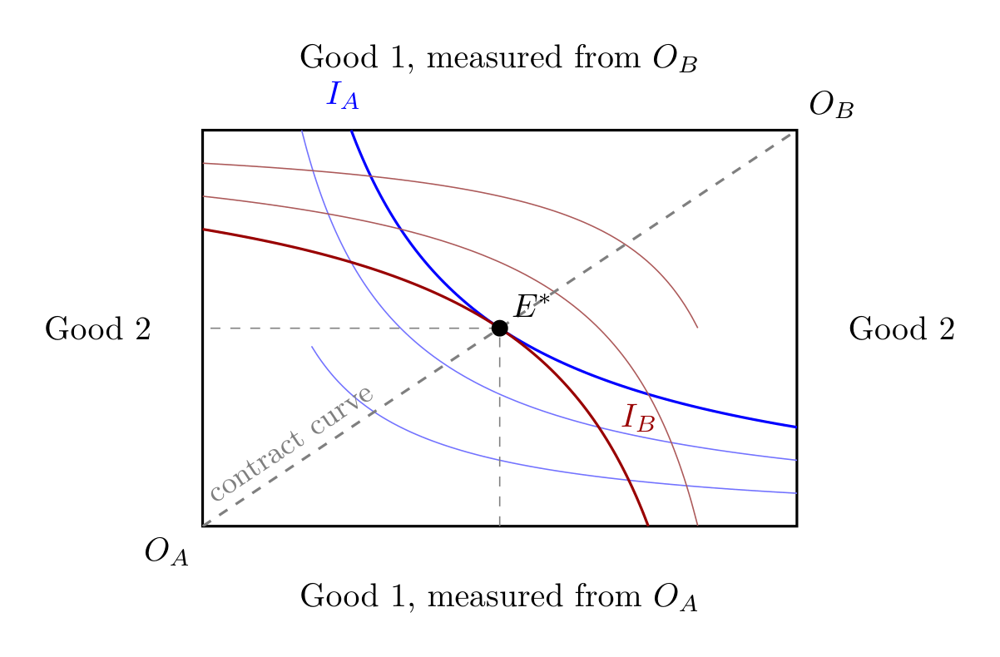

# dsh-rigorquant

[English](README.md) | **简体中文**

<p align="center">
  

</p>
<p align="center"><sub>
  <a href="docs/figs/edgesworth-box.png">埃奇沃思盒</a> —
  由 <a href="https://en.wikibooks.org/wiki/LaTeX/PGF/TikZ">TikZ</a> 手绘，非 AI 生成图
</sub></p>

面向 [DeepSeek Harness](https://github.com/deepseek-ai/deepseek-harness) 的
**会话内无人值守、长时运行的实证/计算数学研究**框架——覆盖经济学、金融、组合
构建与优化、模拟、计算经济/金融等领域。

RigorQuant 是一个 Agent preset + 内置技能，把一次 DSH 会话变成一个上下文隔离的
多智能体研究实验室：

- **J-Space** 作为推理时认知控制层，被整体集成到根 persona、每个子智能体角色
  与 plan mode：工作台门控、账本、接缝刷新、稠密内轨/干净外轨。
- **并行探索者**提出候选方法（`subagent_explorer`，空白上下文）。
- **离网思考者（OffGridThinker）**（`subagent_offgrid`）在路线需要隔离时上
  场：只凭模型自身的推理加上计算工具（sympy、numpy、mpmath、Lean 校验器）
  ——无网络、无文献、不使用他人的结果。
- **真值轨道**独立重推导简化情形下的解析闭式解、不变量与界——用两种不同手段
  各推一遍（两次独立的 `subagent_double_checker` 调用）。
- **对抗者**只凭反例淘汰路线。
- **四项检验**（闭式解相等、精确不变量、解析界、统计强化）在数值实现
  **之前**运行。
- **元校验器**（`rq_check.py`）会拒绝证据缺失的 PASS：阶段产物为空、
  `derivations/` 为空、registry 中没有带审计引用的 passed 路线、交付物无法
  编译等。其证据检查只读审计记录，不读 `study.json`——研究不能为自己作证。
- 随机工作采用**固定种子 + 大数定律**约定。
- **jacobian MCP 升级通道**（opt-in；Lean 作为手动外部通道）在实现前解决证明
  关键性断言。
- **PASS → 自动实现并继续；BLOCKED → 同一缺口连续 3 轮 → 交付最强推导 + 精确
  缺口；BUDGET → 5 轮 → 存档 + 报告。**

运行范式改编自金山木医生攻克 Crouzeix 猜想的过程
（[提示词](https://github.com/jinshanmu/CrouzeixConjecture/blob/main/crouzeix_conjecture_prompt.txt)、
[Lean 审计](https://github.com/jinshanmu/CrouzeixConjecture/tree/main/Lean)）
与陶哲轩的 blueprint/等式理论项目，并落到数值工作。完整设计记录：
[docs/architecture.md](docs/architecture.md)。

**"无人值守"的准确含义：**框架在**单个会话内**无人值守运行；跨会话边界会解除
goal，需要一次人工回合（"continue"）重新武装；它不会跨重启自主续跑。

## 研究团队——以及它如何运作

一个枢纽周围的八个角色，每个都是独立的工具，各有能力边界。编排者是唯一能看到所有汇报的角色；这种分离由组合本身强制，因此**生产者绝不自查自己的成果**——一个想法只会死于具体反例，绝不因风格或感觉而死。


**编排者** · `root persona`——扇出工作、综合结果并写状态。受四条铁律约束：生产者≠检查者、只凭反例淘汰、随机运行必记种子、承重命题不许空谈。

<br clear="left">


**探索者** · `subagent_explorer`——白纸上下文、刻意发散。给出引理、方程、构造与带精确陈述的候选方法；拒绝状态汇报式输出。

<br clear="left">


**离网思考者（OffGridThinker）** · `subagent_offgrid`——离网通道。只凭模型自身的推理加上固定的计算通道（sympy、numpy、mpmath、cvxpy、hypothesis、jax；已配置时还有 Lean 校验器）——除此之外什么都没有：无联网、无技能、无委派、不使用他人的结果。它是独立的智能体，不是探索者的变体：隔离即身份。

<br clear="left">


**双重复核（DoubleChecker）** · `subagent_double_checker`——盲态（无联网、无技能、无委派、无草稿）。从第一性原理把关键命题重推两遍，方法各异。

<br clear="left">


**对抗者** · `subagent_adversary`——执行检验组、专找反例。以裁决收尾：`PASS` 或 `NEEDS-EDITS`。

<br clear="left">


**文献线** · `subagent_lit_line` · `_adversary`——封闭式引文图遍历，再由独立对抗者重取每条主张，确认其真实**且**不过时。

<br clear="left">


**校验器** · `rq_check.py` + schemas——证据缺失即拒绝 `PASS`。只读审计记录，绝不读研究自称的主张——研究无法为自己作保。

<br clear="left">


**文档对抗** · `subagent_document_adversary`——一个独立智能体，逐一审计每份交付物的**自足性**（约九成 AI 生成内容恰恰会省略这点）：文档用到的每个专业术语、符号与缩写，都必须在文档自身或受众规范的符号表中有定义。返回 `VERDICT: PASS` / `VERDICT: NEEDS-EDITS`；`NEEDS-EDITS` 是阻塞性缺陷，校验器在缺失时会拒绝 `PASS`。

<br clear="left">

### 团队实时视图——活动面板

本插件带有一个**实时活动面板**（宿主半 `rq-activity` + 浏览器半的
`shell.overlay` 悬浮件）：RigorQuant 会话运行期间，主窗口右侧垂直居中处会
出现一个小圆点气泡（跟随会话列，避开左侧工作区与右侧停靠的面板），点开后
**只显示当前会话对应的实验室**（不会显示其他会话，且仅当当前会话是
RigorQuant 会话时），展示**五步循环所处阶段**、枢纽-辐条式角色地图（编排者居中，可委派的每个
角色为一根辐条）、各角色的执行/空闲花名册（含 `docs/figs/` 中的角色头像）、
每个角色的最近动作，以及
按时间倒序的动态流。它纯属观察——只读取核心已发布的事件，并在
`/plugins/dsh-rigorquant/...` 上提供 JSON 快照与头像，不改变任何工具、
路由或模型。颜色全部使用 `--dsw-alias` 令牌，因此自动跟随外壳自身的
明暗主题。

<p align="center">
  
</p>

上图是同款设计的读者友好静态渲染（实时面板只在运行中的 web 会话里可见），
改绘自
[dsh-agent-teams](https://github.com/NanmiCoder/dsh-agent-teams)
的实时活动面板——[其 README 中的那张图](https://github.com/NanmiCoder/dsh-agent-teams/blob/main/assets/ui.png)——这里展示 RigorQuant 自身八个角色在"扇出"时刻的状态。面板
SVG 由 [`docs/figs/agent-team-activity.js`](docs/figs/agent-team-activity.js) 生成。

> **署名。** 活动面板设计改编自
> [dsh-agent-teams](https://github.com/NanmiCoder/dsh-agent-teams)，作者
> [NanmiCoder](https://github.com/NanmiCoder)（程序员阿江 / Relakkes）——
> Copyright (c) 2026，MIT 许可证。角色头像为本仓库 `docs/figs/` 自有资源；
> 顶部横幅同样改自上游 hero 图。

**五步循环。** 每轮＝扇出 → 求真 → 对抗 → 综合。

1. **承诺**——逐字记录原始问题，拆成带明确判据的子问题，挑手算可验的简化情形，钉死种子、容差与 schema／校验器摘要。
2. **扇出**——白纸上下文的探索者与文献线并行运行；大多数不会被告知偏好的路线。
3. **求真**——盲态的 DoubleChecker 不看草稿地重推承重命题；凡研究赖以立足之处，必须有两份独立推导。
4. **攻击**——对抗者先跑四关检验，再找反例；分歧的轨道先排成一份裁定案卷。
5. **认证并交付**——校验器确认无遗漏；论文与幻灯由已验证记录装配，绝不现写。

**检验组**，任何数值实现之前运行：**A** 闭式等价 · **B** 精确不变量 · **C** 解析界 · **D** 统计加固（固定种子 + LLN 按 ≈ C/√N 收缩）。

**有据可查：**一次硬核运行中，21 个错误全部被特定机制捕获、无一靠运气（其中 11 个出自编排者自己）；81 条文献主张中仅 35% 通过独立验证；诚实闸门本身也经测试——一份伪造研究*必须*失败。

## 安装

需要 DSH ≥ 0.1.2-alpha.1（preset 使用原生子代理 `agentOptions.reasoningEffort`）。

两种安装形态：

**Bundle（一条命令，完整可用）**——仓库声明了 `dsh.bundle` manifest，其中的
`rq-preset-sync` 行会在 profile 下次启动时，把 agent preset 落盘到
`$DSH_HOME/.agent-presets/rigorquant`、把计算通道落盘到
`$DSH_HOME/share/rigorquant/`，因此生态的 `dsh plugin add` 安装路径即可获得
完整框架（设计记录：docs/architecture.md 决策 23）：

```sh
dsh --version                 # 必须 >= 0.1.2-alpha.1
dsh plugin --profile web add github:linxichen/dsh-rigorquant
```

启动同步是幂等的（字节一致的目录不动；`.venv` 等派生状态既不复制也不清除），
同版本下保留对已安装 preset 的本地修改——升级时替换随包文件，与重跑
`./install.sh` 一致。DSH 的插件 CLI 没有卸载钩子，因此移除始终是显式操作
（`./install.sh --uninstall`）；若只移除插件，已同步的 preset 仍可独立运行，
只是不再有模型路由。

**Preset（完整框架，显式安装）**——RigorQuant 智能体预设（persona + 编排 + 工具）
及内置技能：

```sh
git clone https://github.com/linxichen/dsh-rigorquant
cd dsh-rigorquant
./install.sh                    # 安装 preset + 技能 + 计算通道 + 插件
# ./install.sh --skill-only     # 或只安装技能（rigorquant、arxiv、academic-paper-search）
# ./install.sh --uninstall      # 移除 preset、技能与共享通道
```

启动一个新的 DSH 会话并选择 **RigorQuant** preset，然后说：

> rigorquant：为 [问题] 推导并验证一个方法，先在简化情形上验证，再做数值实现。

## 计算通道（一次性）

固定的 uv 通道位于 `$DSH_HOME/share/rigorquant/env`，由 `install.sh` 或插件的
boot-sync 行落盘——两者写入的字节一致，最后运行者持有该锚点（见
[env/README.md](env/README.md)）。venv 本身**从不随包安装**：它是派生状态，
由第一次 `uv run --frozen --project <env_lane>` 在锚点内**惰性创建**（后续
调用即时；`--frozen` 严格遵守已提交的 lockfile）。jacobian 升级通道默认
**关闭**且已**固定版本**（`jacobian@0.12.0`）：先启用 `mcp-jacobian` 行，
框架在一次性配置前会**请求批准**（`npx -y jacobian@0.12.0 upgrade`，或通过
技能内的 `scripts/provision-lean.sh` 安装 Lean 工具链）。详见
[mcp/jacobian.md](mcp/jacobian.md)。

## 角色模型路由（rq-model-router）

内置插件为每个 RigorQuant 角色制定模型与推理强度策略，每个角色各有一个
回退模型。DoubleChecker 与 adversary 的工具行使用 DSH 0.1.2 原生的
`agentOptions` 提供已发布的主选（`deepseek-v4-pro` @ `high`）；路由器只
覆盖设置中明确的选择，并处理回退重试。配置入口：**设置 → 插件 →
RigorQuant 模型路由**；最后一次保存的选择会持久化（写入设置用户层）。默认配置：

| 角色 | 主选 | 回退 |
| --- | --- | --- |
| 双重复核（DoubleChecker） | `deepseek-v4-pro` @ high | `deepseek-v4-flash` @ low |
| 对抗审计 | `deepseek-v4-pro` @ high | `deepseek-v4-flash` @ low |
| 根编排者、探索者、离网思考者、文献/文档角色 | 继承（root 跟随聊天框选择器） | — |

主选路由遇到终止性失败（无适配器 / HTTP 4xx；包括官方额度响应
`1308` / “Usage limit reached”）时，该角色降级到自己的回退模型并强制重试一次；下一次成功或 10 分钟后恢复主选。未打标签的智能体（其他
preset、workflow 工作进程、fork 子进程）一律不干预。固定层级子代理行使用原生
`agentOptions.reasoningEffort`，需要 DSH ≥ 0.1.2-alpha.1（插件自注册设置）。
设计记录见 [docs/architecture.md](docs/architecture.md) 决策 16。

## 仓库结构

```
package.json                dsh.bundle manifest（支持 dsh plugin add）
cordis.patch.yml            bundle patch：技能层 + rq-model-router +
                            rq-activity + rq-preset-sync 行
dsh/                        宿主半（rq-model-router 路由、rq-activity 监视器、
                            rq-preset-sync 启动同步）与 web 客户端包
                            （设置卡片 + 活动悬浮件）
agent-presets/rigorquant/   preset 组合 + persona + 内置技能
  skills/rigorquant/        SKILL.md + references/ + scripts/ + schemas/
  .../scripts/rq_check.py   元校验器（唯一正式副本）
  .../schemas/              study.json 与 registry.json 的 JSON Schema；
                            校验器直接加载它们，因此二者不会漂移
env/                        固定的 uv 计算通道（sympy/cvxpy/hypothesis/…）
mcp/jacobian.md             升级通道接线说明
docs/architecture.md        逐项确认过的设计决策记录 + 资料来源
docs/figs/agent-team-activity.svg  读者友好的活动视图静态图
docs/figs/agent-team-activity.js   其生成脚本（测试锁定不漂移）
docs/figs/agent-team-hero.svg       团队图横幅，改自 dsh-agent-teams
                            的 hero 图（见下方署名）
tests/                      校验器测试套件（见下方"测试"）
studies/                    每个任务一个研究文件夹（Mode B；各 checkout 自己的
                            活跃研究，不随 bundle 发布）
```

## 测试

校验器自带测试套件，核心是一个**伪造的 study**：空的 derivations、空的阶段
产物、一行字的对抗者报告，以及正文写着"This paper says nothing."的论文。
它必须 FAIL。诚实性闸门若自身没有测试，就会为递给它的任何东西背书。

```sh
uv sync --frozen --project env
uv run --frozen --project env python -m pytest tests/ -q
```

`tests/test_repo_consistency.py` 负责另一半：唯一的校验器、唯一的 schema、
文档中可解析的命令、与文件系统一致的目录说明。

**校验器通过意味着什么：**声明的证据齐备、交付物可编译；它**不**意味着数学
是对的——那仍然由检验组、独立真值轨道与对抗者负责。

## 研究（Study）

一个 **study** 是一个自包含的 rigorquant 任务，各处内部结构完全一致：持久化
成果位于 study 根目录（`study.json`、`STUDY.md`、`registry.json`、
`journal.md`、`derivations/`、`audits/`、`artifacts/`），应当提交；所有草稿
都在被 git 忽略的 `interim/` 中。两种模式，由位置决定：

- **一仓库一研究** — `study.json` 在仓库根目录。
- **一仓库多研究** — `studies/<slug>/study.json`；清单即 `studies/*/study.json`。

启动时检测到已有 study 则静默续跑；新 study 只问一次（模式 + slug），之后不再
询问。详见 [docs/architecture.md](docs/architecture.md) 第 12 条。

## 发布

本仓库是社区 DSH 插件发行物（bundle + preset + 技能形态）：`package.json` 声明
`dsh.bundle` manifest，已打上
[`dsh-plugin`](https://github.com/topics/dsh-plugin) 标签，可被生态内基于
topic 的索引发现——约定参见
[dsh-find-plugins](https://github.com/Nagi-ovo/dsh-find-plugins) 与
[awesome-deepseek-harness](https://github.com/0xsline/awesome-deepseek-harness)。

MIT License。
